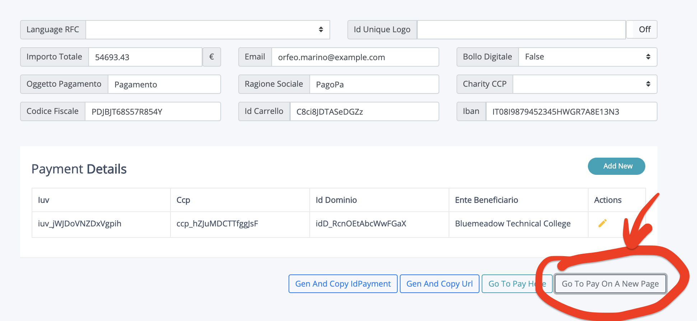
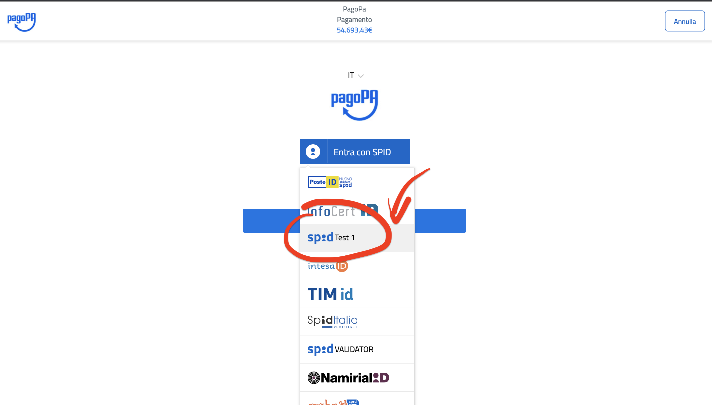
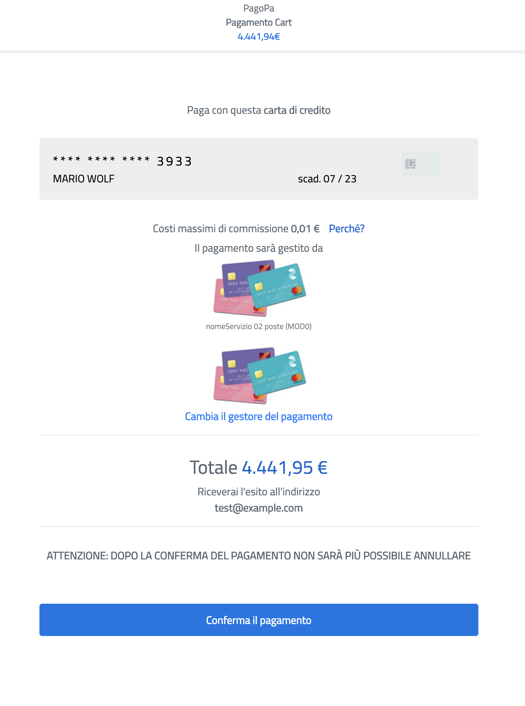

# pagopa-wisp2.0-pp-server
PM : Payment manager & WISP2

- [pagopa-wisp2.0-pp-server](#pagopa-wisp20-pp-server)
  - [Prerequisites](#prerequisites)
  - [Entries to add in the Host file](#entries-to-add-in-the-host-file)
  - [1. Project cloning from git](#1-project-cloning-from-git)
  - [2. Add Oracle dependency](#2-add-oracle-dependency)
  - [3. Build and Start Container](#3-build-and-start-container)
  - [4. Building the back-end side:](#4-building-the-back-end-side)
  - [5. Deploy on wildfly](#5-deploy-on-wildfly)
  - [6. WISP GetStarted 🚀](#6-wisp-getstarted-)

>The following steps show how to run _only_ WISP locally :

## Prerequisites

- [git](https://git-scm.com/)
- [maven](https://maven.apache.org/)
- [docker](https://www.docker.com/) + account on [dockerhub](https://hub.docker.com/)
>the `docker` account is needed to be able to `pull` the image [oracle-db-ee](https://hub.docker.com/_/oracle-database-enterprise-edition) and for which accept the **Terms of Service** via web


## Entries to add in the Host file
 
On windows, open `C:\Windows\System32\drivers\etc\hosts` while on linux/macos, open `/etc/hosts`
and add the following entries:

```
127.0.0.1 spid-testenv2
127.0.0.1 spid-testenv2-2
127.0.0.1 pagopa-dev
127.0.0.1 spid-validator
```

## 1. Project cloning from git
 
First of all, clone the project

```
git clone https://github.com/pagopa/pagopa-wisp2.0-pp-server pagopa-wisp2.0-pp-server && cd $_
```

## 2. Add Oracle dependency

Now from `cd pagopa-wisp2.0-pp-server` folder (_created by the previous step_) typing

```
cd wildfly/docker/oracle/
```
and
```
mvn install:install-file -Dfile=./ojdbc8-12.2.0.1.jar -DgroupId=com.oracle -DartifactId=ojdbc8 -Dversion=12.2.0.1 -Dpackaging=jar
```

## 3. Build and Start Container
 
Return into parent folder project directory `pagopa-wisp2.0-pp-server` and run
```
docker-compose up
```
> This commmand may take a few minutes (~3/4min) to run up four containers (wildfly,spidtest,oracledb and mocks)
 
## 4. Building the back-end side:

Then compile _ALL_ packages typing :

```
cd pp-server
mvn clean install -T1C
```
if all rights, you'll see something like that :

```
[INFO] [PP Server] Pago PA application .................... SUCCESS [  1.055 s]
[INFO] commons ............................................ SUCCESS [  5.293 s]
[INFO] [JAR] Pago PA jpa core ............................. SUCCESS [  7.066 s]
[INFO] [JAR] DTO and utility module ....................... SUCCESS [  5.127 s]
[INFO] [JAR] PPT crypto ................................... SUCCESS [  5.951 s]
[INFO] [JAR] Pago PA ejbClient ............................ SUCCESS [  2.621 s]
[INFO] pp-logging-client .................................. SUCCESS [  3.617 s]
[INFO] [JAR] SMS-Client ................................... SUCCESS [  4.399 s]
[INFO] [JAR] SIA-VPos-Client .............................. SUCCESS [  3.330 s]
[INFO] [APP] Pago PA REST API ............................. SUCCESS [  0.221 s]
[INFO] [JAR] pp-restapi-client ............................ SUCCESS [ 14.528 s]
[INFO] lunaeft ............................................ SUCCESS [  5.421 s]
[INFO] [JAR] Pago PA - jiffy-client ....................... SUCCESS [  8.287 s]
[INFO] [APP] Pago PA EJB .................................. SUCCESS [  0.221 s]
[INFO] [JAR] Pago PA EJB Core ............................. SUCCESS [  5.155 s]
[INFO] pp-ejbBatch ........................................ SUCCESS [  2.851 s]
[INFO] [EAR] Pago PA EJB BATCH EAR ........................ SUCCESS [  2.703 s]
[INFO] [WAR] Pago PA RestApi Web .......................... SUCCESS [ 10.237 s]
[INFO] [WAR] Pago PA RestApi Server ....................... SUCCESS [  7.136 s]
[INFO] [EAR] Pago PA RestApi .............................. SUCCESS [  4.219 s]
[INFO] [APP] Pago PA REST API - Cittadinanza Digitale ..... SUCCESS [  0.311 s]
[INFO] [WAR] Pago PA RestApi Web - Cittadinanza Digitale .. SUCCESS [  9.577 s]
[INFO] [EAR] Pago PA RestApi - Cittadinanza Digitale ...... SUCCESS [  3.648 s]
[INFO] [APP] Pago PA Wallet ............................... SUCCESS [  0.354 s]
[INFO] [WAR] Pago PA Wallet Web ........................... SUCCESS [ 14.450 s]
[INFO] [EAR] Pago PA Wallet ............................... SUCCESS [  3.621 s]
[INFO] [JAR] Pago PA restapi-test ......................... SUCCESS [  4.285 s]
[INFO] [Report Test] Pago PA gatling test ................. SUCCESS [  3.917 s]
[INFO] [APP] Pago PA Admin Panel .......................... SUCCESS [  0.275 s]
[INFO] [WAR] PP Admin Panel ............................... SUCCESS [ 14.033 s]
[INFO] [EAR] Pago PA Admin Panel .......................... SUCCESS [  4.385 s]
[INFO] [JAR] Billing batch ................................ SUCCESS [  4.104 s]
[INFO] pp-logging ......................................... SUCCESS [ 10.301 s]
[INFO] ------------------------------------------------------------------------
[INFO] BUILD SUCCESS
[INFO] ------------------------------------------------------------------------
[INFO] Total time:  36.169 s (Wall Clock)
[INFO] Finished at: 2020-10-27T10:12:53+01:00
[INFO] ------------------------------------------------------------------------
```
>compilation should take about 40sec, although the WISP will only take two `ear` : `pp-restapi` e `pp-wallet`

## 5. Deploy on wildfly

Coping the `pp-restapi` e `pp-wallet` packages into `Wildfly` folder deploy typing :

```
cp ./pp-wallet/pp-wallet-ear/target/pp-wallet-ear-0.0.0 ../wildfly/docker/deployments/

cp ./pp-restapi/pp-restapi-ear/target/pp-restapi-ear-0.0.0.ear ../wildfly/docker/deployments/
```

if all rights into same folder `wildfly/docker/deployments`  you'll see 2 new files :

```
pp-restapi-ear-0.0.0.ear.deployed
pp-wallet-ear-0.0.0.ear.deployed
```
it indicates the success of the deployment.

## 6. WISP GetStarted 🚀

Now click on the following [link](http://localhost:8082/pa/payment/gen/nodo) and then on `Go To Pay On A New Page` button
> Here you can add more [IUV](https://docs.italia.it/italia/pagopa/pagopa-codici-docs/it/stabile/_docs/Capitolo2.html) to `Payments Details`


you'll redirect on SPID page, here select **spid Test1** provider and use as user/pwd : **test/test**

 
then select your payment method (ex. CC) and continue ... 
> to generate a good or not credit card number click [here](http://localhost:8082/cc) using  `Generate OK` or `Generate KO` , all other data can be random

then click on `Continua`


then click on `Conferma`


